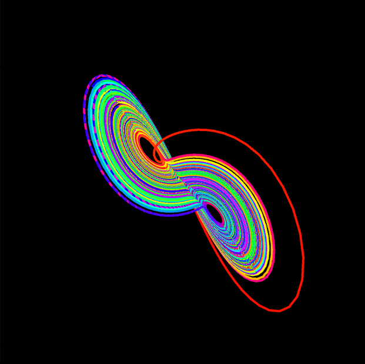
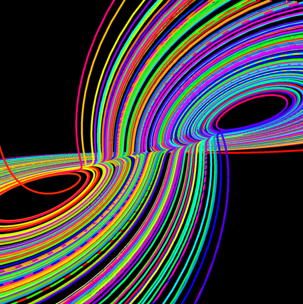

# Lorenz Attractors

Lorenz Attractors is an interactive visual demonstration of Lorenz systems.  
Start date: 2020-10-31  

## Demo

## Dependencies

- [Processing 4.0 beta 1](https://processing.org/download)
  - PeasyCam library

## Installation

Open any of the `*.pde` files with Processing (IDE).

## Usage

1. Launch the program using Processing (IDE).
1. Click and drag the display to rotate the camera. Scroll to zoom.

## Acknowledgements

- Inspired by [a video on YouTube](https://www.youtube.com/watch?v=f0lkz2gSsIk).

## Author

- **Jeffrey Andersen** &mdash; [GitHub Profile](https://github.com/anderjef) &bull; [Website](https://anderjef.github.io)

## License

For copyright, license, and warranty, see [LICENSE.md](LICENSE.md).
